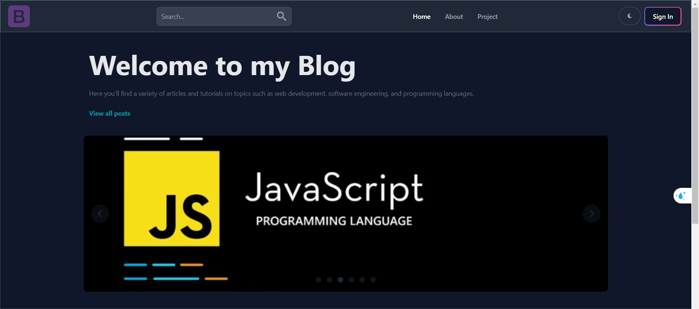
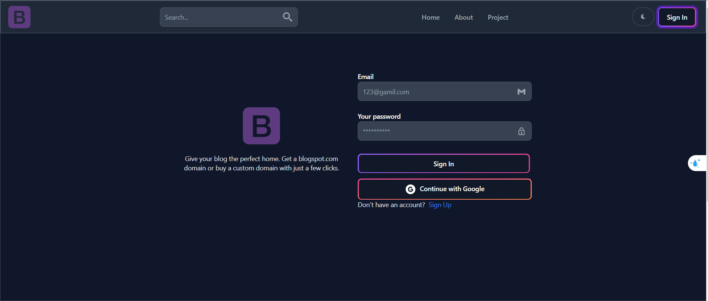
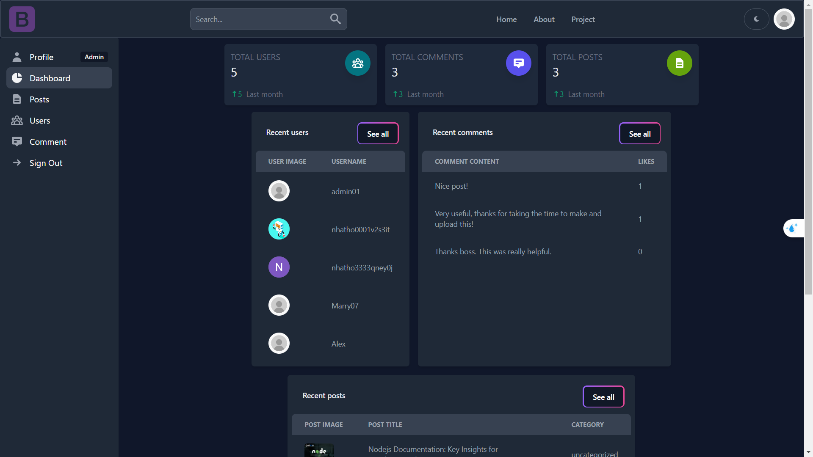
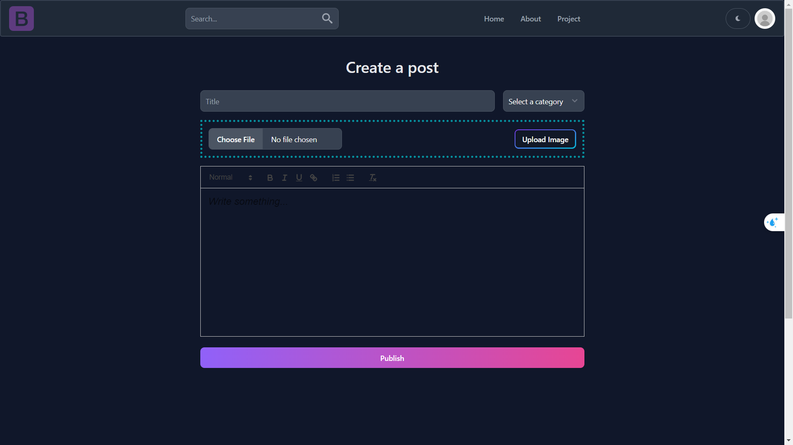

## MERN Blog App
### Description

The **MERN Blog App** is a full-stack blogging application built using the MERN stack (MongoDB, Express.js, React, Node.js). This application allows users to create, read, update, and delete blog posts. It also includes user authentication and authorization, allowing users to register and log in to manage their own posts. Admins can manage users, posts, and comments through the dashboard.
### Image
#### Home page

#### Login Form

#### Dashboard

#### Create a blog

### Features
* **User Authentication**: Register, Login, Logout.
* **CRUD Operations**: Create, Read, Update, and Delete blog posts.
* **User-specific Post Management**: Users can manage their own posts.
* **Admin Post Management**: Admin can manage all posts.
* **Responsive Design**: Ensures usability across various devices.

## Technologies Used

### Frontend
* **React**: A JavaScript library for building user interfaces
* **Redux**: State management library
* **Tailwindcss**: Styling

### Backend
* **Node.js**: JavaScript runtime built on Chrome's V8 JavaScript engine
* **Express.js**: Web framework for Node.js

### Database
* **MongoDB**: NoSQL database
* **Mongoose**: MongoDB object modeling tool
* **Firebase**: Image repository
  
### Authentication
* **JSON Web Tokens (JWT)**: For secure user authentication
* **bcrypt**: For password hashing

